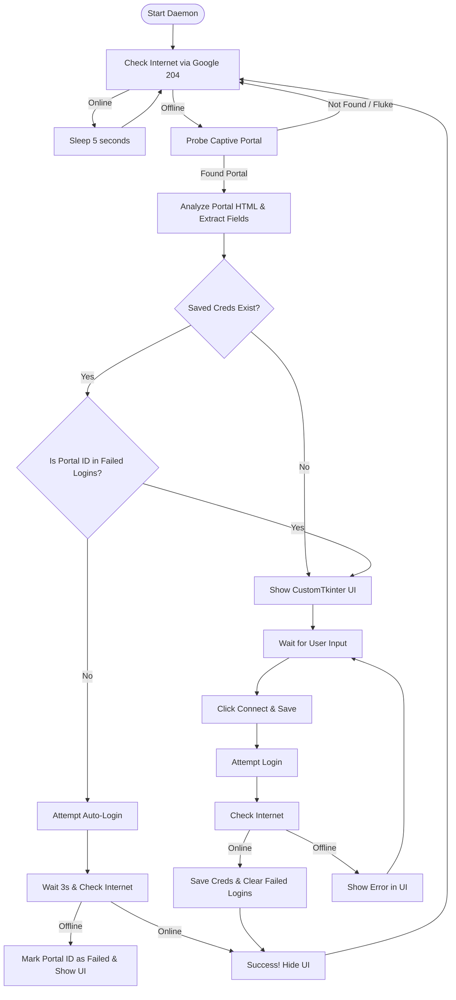

# WiFi Auto-Login Daemon 📶

[](https://www.python.org/)
[](#-cross-platform-support)
[](#%EF%B8%8F-security--credential-storage)

A lightweight, cross-platform background service that automatically logs into Captive Portals (University, Hostel, Corporate, or Hotel WiFi networks). 

The app runs silently in your system background, monitors your connection, detects when your internet drops due to a captive portal redirect, and automatically authenticates using securely saved credentials.

---

## 🔄 How It Works (Application Flow)



---

## ✨ Key Features

*   **Silent Background Operation:** Runs invisibly as a background daemon, only displaying a UI when user interaction is required (e.g., credentials need input or update).
*   **Universal Captive Portal Parser:** Automatically scans the portal's HTML form to find username and password input fields and dynamically collects hidden request tokens.
*   **Stale Token Bypass:** Re-fetches a fresh page and CSRF tokens right before login to prevent "Session Timeout" issues common to long-dormant portal pages.
*   **Cyberoam/Sophos Special Case Support:** Automatically detects orphan form inputs (common on Cyberoam gateways) and forces submission to `/login.xml` with appropriate modes.
*   **OS Keychain Security:** Integrates with your system's native keychain database to encrypt and safeguard password credentials.
*   **Automatic Database Migration:** Automatically moves existing plain-text password entries from older versions into the secure OS Keychain database and updates metadata formats.
*   **Thread-Safe UI:** Uses non-blocking background network threads and maps GUI updates back to the main thread via CustomTkinter safe loop scheduling.
*   **Smart Login Failure Protection:** Tracks login portal domains that have failed authorization to prevent hammering the captive portal server in an infinite loop with wrong credentials.

---

## 🛡️ Security & Credential Storage

Your credentials are treated with the highest security standards:
1.  **Passwords:** Saved using the OS native credential store (macOS Keychain, Windows Credential Manager, or Linux Secret Service) using the Python `keyring` library.
2.  **Metadata:** SSIDs, usernames, and portal identifiers are saved in a local database `wifi_map.json` in the user's persistent system directory. Passwords are never saved in this file.
3.  **Plaintext Fallback:** If the `keyring` library is unavailable, the system safely falls back to standard JSON storage and prints a CLI warning.

### Persistent File Paths (Per OS)
The non-sensitive network mapping (`wifi_map.json`) is stored in standard application directories so it persists across PyInstaller rebuilds:
*   **macOS:** `~/Library/Application Support/WifiAutoLogin/wifi_map.json`
*   **Windows:** `%APPDATA%\WifiAutoLogin\wifi_map.json`
*   **Linux:** `~/.config/WifiAutoLogin/wifi_map.json`

---

## 📂 Project Structure

*   [main_ui.py](file:///Users/hirdyanshuchanaria/Desktop/NETLOG/main_ui.py): CustomTkinter-based GUI layout, startup management, thread-safe message scheduling, and background daemon loop.
*   [universal_solver.py](file:///Users/hirdyanshuchanaria/Desktop/NETLOG/universal_solver.py): Core network probing logic, BeautifulSoup HTML parsing, and HTTP POST/GET request executors.
*   [network_manager.py](file:///Users/hirdyanshuchanaria/Desktop/NETLOG/network_manager.py): Hardware integration layer that executes platform CLI utilities to fetch SSID names and verify active web connectivity.
*   [storage.py](file:///Users/hirdyanshuchanaria/Desktop/NETLOG/storage.py): Manages persistent configurations, Keychain access, plaintext-to-keyring migrations, and database schema updates.
*   [WifiAutoLogin.spec](file:///Users/hirdyanshuchanaria/Desktop/NETLOG/WifiAutoLogin.spec): Spec configuration file defining the building pipelines for PyInstaller executable compilation.

---

## 👨‍💻 Running from Source (Development)

> [!IMPORTANT]
> Make sure to install `keyring` to enable secure credential storage in macOS Keychain or Windows Credential Manager.

1.  **Install dependencies:**
    ```bash
    pip install customtkinter requests beautifulsoup4 keyring pyinstaller
    ```

2.  **Run the application:**
    ```bash
    python main_ui.py
    ```

---

## 📦 Packaging and Standalone Builds

To package this application into a standalone executable (`.exe` on Windows or `.app` on macOS), use PyInstaller with the provided specification file.

### 🍎 Build on macOS
1.  Open Terminal in the project directory.
2.  Compile using the spec file:
    ```bash
    pyinstaller --clean WifiAutoLogin.spec
    ```
3.  **Output:** Your compiled application bundle `WifiAutoLogin.app` will be created inside the `dist/` directory.
4.  **To Distribute:** Compress `WifiAutoLogin.app` into a `.zip` archive, send it to users, and have them move it into their `/Applications` folder.

### 🪟 Build on Windows
1.  Open PowerShell or Command Prompt in the project directory on a Windows machine.
2.  Compile using the spec file:
    ```cmd
    pyinstaller --clean WifiAutoLogin.spec
    ```
3.  **Output:** The compiled executable folder `WifiAutoLogin` (or `WifiAutoLogin.exe`) will be generated inside the `dist/` directory.

---

## 📝 License
This project is open-source and free to use for personal and educational purposes.
